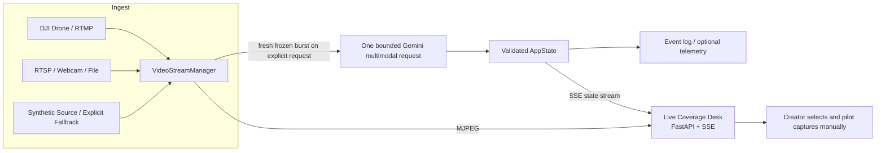

# CinePilot

**An Advisory AI Cinematic Decision Engine**

CinePilot connects a live RTMP/RTSP feed to an advisory cinematic coverage
decision engine. Between takes, a creator-entered story brief and a fresh,
bounded evidence burst are sent in one multimodal Gemini request to return one
ranked next shot and two alternatives. The creator remains in control of
approval, capture, and flight. Synthetic and prerecorded inputs remain
explicitly labeled test/demo sources.

## Product documents

If you are evaluating CinePilot as a creator, director, or production partner,
start with the plain-language product documents:

- [Product brief](docs/product-brief.md) — who CinePilot is for, the problem it solves, and its boundaries.
- [Creator workflow](docs/creator-workflow.md) — how the live-feed, between-takes workflow works.
- [Product evidence and claims](docs/product-evidence.md) — what is verified, unverified, and still requires creator evaluation.

## Product loop

The primary live coverage loop is:

```text
enter story context -> consent -> wait for a fresh live frame -> analyze current take
-> identify observed and missing coverage -> select one next shot
-> pilot captures manually -> mark take captured -> evaluate a new fresh burst
```

Each analysis returns observed facts, explicit limits, missing coverage, one
primary recommendation, and two alternatives. Every recommendation includes a
diagnosis, story purpose, visual objective, why-now rationale, manual execution
guidance, technical plausibility, safety notes, priority, and optional model
confidence. The creator—not the model—selects, captures, and evaluates the next
take.

The seeded story and initial shot intent are available only in explicit
deterministic demo mode. The primary live path requires creator entry through
the Live Coverage Desk and explicit cloud consent. The older continuous Gemini
Live critique and spoken-guidance path remains an opt-in compatibility surface;
it is not the primary workflow. The exact walkthrough is in
`docs/demo-script.md`.

The current implementation is intentionally local and session-scoped. It
writes observations, analysis attempts, recommendations, creator decisions,
captures, evaluations, and legacy critique events to an append-only JSONL log.
The optional legacy path can also publish tool calls and telemetry to Grafana
Loki.

## How It Works



1. **`VideoStreamManager`** grabs frames from RTMP, RTSP, a webcam, a local video file, or a synthetic OpenCV-generated aerial scene. Real sources run through an explicit status machine (`connecting → live → stale → disconnected → reconnecting`) with exponential-backoff reconnects, stale-frame detection, and redacted stream URLs. A failed real source **never** silently becomes synthetic footage — synthetic fallback requires explicit opt-in (`--allow-synthetic-fallback` or `--demo-mode`).
2. **Explicit analysis jobs** capture three to eight fresh frames only after the creator presses **Analyze current take**. Raw bytes are transient and deleted after processing; the observation metadata and provenance remain auditable. The legacy `DirectorAgent` path is disabled by default.
3. The bounded Gemini adapter receives the frozen burst and structured context,
   requests the strict `TakeAnalysisResult` response schema, and validates the
   returned JSON again with Pydantic before canonical state can change.
4. Creator selection, manual capture, and follow-up evaluation are separate,
   auditable transitions. A new evidence burst is required for evaluation.
5. Every analysis attempt, observation, recommendation, creator decision,
   capture, and evaluation is recorded in the append-only local event log.
6. The optional **Visual Reference** workspace renders three deterministic,
   illustrative 10-second concepts from a frozen source frame. These previews
   are not live evidence, spatial reconstruction, or flight instructions.

## Dashboard tour

- **Header** — source, provenance, cloud-consent, and state-freshness status.
- **Coverage Desk** — story context, active beat, source truth, explicit analysis,
  observed evidence, missing coverage, ranked recommendations, creator decision,
  capture, follow-up evaluation, and coverage history.
- **Visual Reference** — three bounded illustrative concepts derived from the
  current frozen source frame and recommendations.
- **System details** — secondary source, provider, event-stream, raw-media,
  Grafana, and legacy compatibility diagnostics.

The dashboard answers: what story are we telling, what beat are we in, what did
the current shot establish, what remains missing, and which next shot could
advance the story. Deterministic fixture behavior is labeled separately from
live Gemini behavior.

The story-first dashboard also includes an advisory Visual Reference tab. With a
synthetic, prerecorded, webcam, RTSP, or RTMP source, the creator can freeze the
latest source frame and request exactly three fixed 10-second concept
animations. The response shows source provenance, snapshot dimensions,
renderer version, and render-quality notes. The concepts are illustrative 2D
references, not selectable coverage decisions, flight truth, obstacle maps,
spatial reconstruction, or evidence that the captured shot improved.

## Quick Start

### Prerequisites

- Python 3.10+
- A [Gemini API key](https://aistudio.google.com/apikey) for live bounded
  analysis; no key is required for deterministic demo mode
- (Optional) An RTMP server receiving your drone feed, e.g. [MediaMTX](https://github.com/bluenviron/mediamtx) or nginx-rtmp
- (Optional) Grafana Cloud Loki credentials for telemetry

### Install

```bash
git clone https://github.com/dutraa/cinepilot.git
cd cinepilot
pip install -r requirements.txt
```

### Configure

Copy the example environment file and add your key:

```bash
cp .env.example .env
```

```ini
GEMINI_API_KEY=your_gemini_api_key_here
GEMINI_MODEL=gemini-2.5-flash
RTMP_URL=rtmp://127.0.0.1:1935/live/drone
GRAFANA_URL=
GRAFANA_USER=
GRAFANA_API_KEY=
```

### Run

No drone handy? Start with the built-in synthetic aerial scene and the normal
creator-entered/live-provider workflow:

```bash
python main.py --source synthetic
```

To run the complete repeatable story-aware demo without a Gemini key, drone,
RTMP, or Grafana:

```bash
python main.py --source synthetic --demo-mode
```

Then open **http://127.0.0.1:8000** in your browser.

Other sources:

```bash
# Live drone feed via RTMP (e.g. DJI Fly -> MediaMTX; see docs/real-drone-setup.md)
python main.py --source rtmp --stream-url rtmp://127.0.0.1:1935/live/drone

# An RTSP camera or MediaMTX republish
python main.py --source rtsp --stream-url rtsp://127.0.0.1:8554/live/drone

# Explicit synthetic demo mode
python main.py --source synthetic --demo-mode

# A local video file (loops forever)
python main.py --source file --video-path footage/flight01.mp4

# Your webcam, on a different port
python main.py --source webcam --port 8080
```

`--rtmp-url` is still accepted as a backward-compatible alias for `--stream-url`.

If a real RTMP/RTSP/webcam source fails or disconnects mid-flight, CinePilot reports `disconnected`, drops the stale frame, shows a clearly-labeled "NO LIVE SIGNAL" card, and reconnects with exponential backoff — it does **not** silently switch to synthetic footage. To allow synthetic fallback explicitly (demos only), pass `--allow-synthetic-fallback` or `--demo-mode`; the fallback is then visibly labeled in the dashboard and in the evidence log.

For the full real-drone workflow (DJI Fly/Pilot → MediaMTX → CinePilot on Windows 11, verification, interruption/recovery behavior), see [docs/real-drone-setup.md](docs/real-drone-setup.md).

### Safety boundary

CinePilot is **advisory only**. It never controls the drone: no autonomous
flight, waypoints, gimbal commands, takeoff/landing, or SDK control calls exist
anywhere in the system, and the model is instructed it must not generate flight
commands or certify that any route is safe. All recommendations are for a human
pilot to evaluate and execute manually; creator actions remain distinct from
model observations and evaluations.

## Configuration Reference

All settings are read from `.env` (or environment variables) via pydantic-settings:

| Variable | Default | Description |
| --- | --- | --- |
| `GEMINI_API_KEY` | *(empty)* | Google Gemini API key. Required for live bounded or legacy Gemini analysis; deterministic demo mode does not require it. |
| `GEMINI_MODEL` | `gemini-2.5-flash` | Bounded Gemini model. |
| `ENABLE_CONTINUOUS_LIVE` | `false` | Explicit opt-in for legacy continuous Gemini Live. |
| `ANALYSIS_TIMEOUT_SEC` | `30.0` | Maximum time allowed for one bounded analysis request. |
| `RTMP_URL` | `rtmp://127.0.0.1:1935/live/drone` | Default RTMP ingest URL. |
| `RTSP_URL` | *(empty)* | Default RTSP ingest URL for `--source rtsp`. |
| `SOURCE_CONNECT_TIMEOUT_SEC` | `10.0` | Seconds to wait for a real source to open. |
| `SOURCE_RECONNECT_DELAY_SEC` | `2.0` | Initial reconnect delay after a disconnect (doubles each attempt). |
| `SOURCE_RECONNECT_MAX_DELAY_SEC` | `30.0` | Reconnect backoff cap. |
| `SOURCE_STALE_AFTER_SEC` | `3.0` | Newest frame older than this ⇒ source reported `stale`. |
| `SOURCE_MAX_FRAME_AGE_SEC` | `2.0` | Frames older than this are never sent to Gemini as current. |
| `SOURCE_HEALTH_INTERVAL_SEC` | `2.0` | Dashboard/health source-state polling cadence. |
| `SOURCE_LOW_LATENCY` | `true` | Keep driver-side capture buffering minimal. |
| `ALLOW_SYNTHETIC_FALLBACK` | `false` | Allow a failed real source to fall back to synthetic frames. Leave off for real flights. |
| `GRAFANA_URL` | *(empty)* | Grafana Loki push endpoint (`.../loki/api/v1/push`). |
| `GRAFANA_USER` | *(empty)* | Grafana Cloud Loki username / tenant ID. |
| `GRAFANA_API_KEY` | *(empty)* | Grafana Cloud API token. |
| `FRAME_INTERVAL_SEC` | `0.8` | Legacy Live sampling interval. |
| `CRITIQUE_COOLDOWN_SEC` | `5.0` | Legacy duplicate-critique suppression window. |
| `EVENT_LOG_PATH` | `runs/cinepilot-events.jsonl` | Append-only local evidence-log path. |
| `HOST` | `127.0.0.1` | Web UI bind host. |
| `PORT` | `8000` | Web UI port (overridable with `--port`). |

Leave the three `GRAFANA_*` values empty to run telemetry in **Dry Run** mode — structured JSON events are printed to stdout instead of being pushed to Loki.

## HTTP API

| Endpoint | Description |
| --- | --- |
| `GET /` | The Director's Monitor dashboard. |
| `GET /video_feed` | Live MJPEG stream (`multipart/x-mixed-replace`). |
| `GET /events` | Server-Sent Events stream of the complete canonical app state. |
| `GET /api/state` | Current story, intent, source, analysis, recommendations, captures, evaluations, visualizations, legacy state, and supporting metrics. |
| `POST /api/intent` | Set the creator's current shot intent. |
| `GET /api/intent` | Return the current shot intent and server-owned intent version. |
| `POST /api/story` | Save creator-entered story context; the server assigns IDs and versions. |
| `POST /api/consent` | Grant or revoke session-scoped cloud-analysis consent. |
| `POST /api/analysis` | Request one bounded fresh evidence-burst analysis. |
| `GET /api/analysis/{job_id}` | Read analysis progress or terminal state. |
| `POST /api/analysis/{job_id}/cancel` | Safely cancel an active analysis job. |
| `POST /api/take-recommendations/{id}/decision` | Select or dismiss a primary/alternative recommendation. |
| `POST /api/take-recommendations/{id}/capture` | Creator marks the selected manual take captured. |
| `POST /api/captures/{id}/evaluate` | Request a fresh follow-up evidence evaluation. |
| `POST /api/critiques/{critique_id}/tweaks/{tweak_id}/decision` | Mark a tweak accepted, acted, or dismissed (creator-only). |
| `POST /api/shots/{shot_id}` | Creator-only shot lifecycle update — the only path that can mark a shot `COMPLETED`. |
| `GET /api/story` | Return the story, ordered beats, active beat, versions, and provenance. |
| `POST /api/story/beat` | Activate or skip a beat through the state machine. |
| `GET /api/coverage` | Return captured, covered, and missing story proof. |
| `GET /api/recommendations` | Return latest recommendations and history. |
| `POST /api/recommendations` | Publish a validated manual recommendation batch. |
| `POST /api/recommendations/{id}/decision` | Select, complete, or dismiss a recommendation. |
| `POST /api/visualizations` | Request exactly three deterministic 10-second concepts for the current story context and frozen source observation. |
| `GET /api/visualizations` | List bounded session-local visualization jobs. |
| `GET /api/visualizations/{job_id}` | Return one visualization job and its linked previews. |
| `GET /api/visualizations/{job_id}/source-frame` | Return the server-frozen JPEG for browser animation while the bounded session job is retained. |
| `GET /health` | JSON system status: full source snapshot (status, provenance, frame age, FPS, reconnects, redacted URL), Gemini/Grafana status, frame counters. |

## Project Structure

```
cinepilot/
├── main.py               # CLI runner: video + web server + agent, graceful shutdown
├── analysis.py           # Bounded burst capture and strict Gemini analysis/evaluation adapters
├── director_agent.py     # Optional legacy Gemini Live compatibility path
├── tools.py              # Legacy Gemini tool declarations and validated executors
├── schemas.py             # Strict intent, critique, tweak, and decision contracts
├── state.py               # Thread-safe active-run state and lifecycle rules
├── event_log.py           # Append-only JSONL evidence events
├── director_prompt.py     # Versioned cinematic-tweak system prompt
├── domain.py              # Dependency-free shared domain constants
├── video_stream.py       # Hot-swappable video sources with synthetic aerial fallback
├── server.py             # FastAPI app, thread-safe AppState, MJPEG + SSE endpoints
├── grafana_publisher.py  # Non-blocking Loki telemetry (background thread / dry-run mode)
├── config.py             # pydantic-settings configuration
├── story_demo.py          # Strict seeded story fixture loader
├── demo_provider.py       # Explicit deterministic recommendation provider
├── templates/
│   └── index.html        # Dark-mode Director's Monitor dashboard
├── AGENTS.md             # Operating contract for coding agents
├── everythings.md        # Compact source-of-truth project map
├── docs/                 # Evidence frame, spec, architecture, decisions, evaluation, demo, issues
├── fixtures/             # Seeded story and held-out evaluation manifest
├── requirements.txt
├── requirements-dev.txt
└── .env.example
```

## Telemetry

When Grafana credentials are set and the optional legacy continuous path is
running, CinePilot can stream two event types to Loki with labels
`{app="cinepilot", env="production"}` and nanosecond timestamps:

- **`tool_call`** — every Gemini tool invocation with its arguments and result.
- **`frame_metrics`** — rolling FPS, response latency (ms), and total frames sent, published every 5 seconds.

A simple LogQL query to see the director at work:

```
{app="cinepilot", event="tool_call"} | json
```

## Notes & Tips

- **Legacy audio guidance** is available only through the opt-in continuous
  Gemini Live compatibility path. The primary Coverage Desk is a silent,
  explicit between-takes workflow.
- **DJI drones** can stream RTMP directly from the DJI Fly / Pilot app to a local RTMP server (e.g. MediaMTX); point `--stream-url` at it. Full walkthrough: [docs/real-drone-setup.md](docs/real-drone-setup.md).
- **Real-drone status**: the RTMP/RTSP observation path is implemented and covered by deterministic fake-source tests, but has not yet been verified against real drone hardware — see the checklist in `docs/real-drone-setup.md`.
- The synthetic source is great for demos and development — it renders a moving subject and tilting horizon; composition guides are added only in the browser so they do not contaminate Gemini's input.
- `FRAME_INTERVAL_SEC`, JPEG quality 80, and the 1024 px frame bound apply to
  the optional legacy Gemini Live path. Bounded between-takes analysis captures
  its own frozen burst independently.

## Verification

Run the application checks with:

```bash
python -m pytest -p no:cacheprovider -q
ruff check --no-cache .
python -c "import ast, pathlib; [ast.parse(p.read_text(encoding='utf-8'), filename=str(p)) for p in list(pathlib.Path('.').glob('*.py')) + list(pathlib.Path('tests').glob('*.py'))]"
git diff --check
```

The video-source tests use a deterministic fake capture adapter (`tests/test_video_stream.py`), so RTMP/RTSP connection, reconnect, stale-frame, and fallback behavior are verified without hardware.

For an isolated browser smoke check, start the deterministic synthetic server
and capture the dashboard with Playwright Chromium:

```bash
python main.py --source synthetic --demo-mode
npx --yes playwright screenshot --browser=chromium http://127.0.0.1:8000 dashboard.png
```

For the full synthetic workflow, open the dashboard, grant session consent,
and verify this sequence:

```text
Analyze current take -> three ranked recommendations -> select one
-> mark take captured -> evaluate fresh burst -> open Visual Reference
-> render three illustrative concepts
```

The expected synthetic evaluation outcome is `unclear`: fresh generated frames
can exercise the contract and state transitions but cannot establish independent
production usefulness.

## License

No license file has been published yet. All rights remain reserved until the
project owner adds an explicit license.
