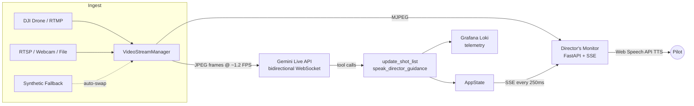

# CinePilot

**An Advisory AI Cinematic Decision Engine**

CinePilot connects live, prerecorded, or synthetic footage to the Google Gemini Live API and turns it into an advisory cinematic decision engine. Gemini watches footage in real time, compares it with a creator-provided story or shot intent, returns one to three structured cinematic tweaks, and can recommend what shot should be captured next to advance the story. The creator remains in control of approval and flight.

## Cinematic Tweak Engine

The current product loop is:

```text
Set shot intent -> watch the shot -> diagnose the highest-impact problem
-> recommend a specific tweak -> creator accepts, acts, or dismisses
-> watch the next result
```

The critique is the canonical product output. A critique contains a summary and up to three tweaks, each with a category, diagnosis, recommendation, rationale, priority, and optional spoken cue. The system is advisory: it does not control the drone or edit footage automatically.

The next demo extends this into a story-aware coverage loop:

```text
load mock story -> watch current shot -> identify current beat and missing coverage
-> recommend two or three next shots -> creator selects one -> capture manually
-> mark coverage complete -> evaluate the next result
```

The seeded story and exact walkthrough are in `docs/demo-script.md`. The
story-aware contracts and deterministic mock loop are implemented locally; live
Gemini story reasoning remains separately labeled and requires a configured key.

The current implementation is intentionally local and session-scoped. It writes critique and creator-action events to an append-only JSONL log for demo evidence and can optionally publish tool calls and telemetry to Grafana Loki.

## How It Works



1. **`VideoStreamManager`** grabs frames from RTMP, RTSP, a webcam, a local video file, or a synthetic OpenCV-generated aerial scene. If a live source drops, it hot-swaps to the synthetic fallback automatically so the pipeline never stalls.
2. **`DirectorAgent`** streams JPEG frames to Gemini Live at ~1.2 FPS over a bidirectional WebSocket and listens for responses.
3. Gemini calls three tools as it directs the shoot:
   - **`publish_cinematic_critique`** — publishes one to three validated cinematic tweaks against the current intent.
   - **`update_shot_list`** — moves the 5-part shot list (Establishing Wide, Top-Down Property, Orbit Pass, Low Reveal, Pull Away) through `PENDING → IN_PROGRESS → COMPLETED / REJECTED` with directorial feedback.
   - **`speak_director_guidance`** — issues spoken flight cues ("Tilt down 15 degrees, subject is drifting off-center") at `INFO` / `WARNING` / `URGENT` priority.
4. Every tool call, critique, action decision, and rolling frame metric is recorded locally and optionally pushed to Grafana Loki.
5. The **Director's Monitor** dashboard shows the live feed with a viewfinder HUD, the real-time shot list, and a guidance banner — and speaks new cues aloud in the browser via the Web Speech API.

## Screenshot Tour

- **Left panel** — live MJPEG monitor with rule-of-thirds grid, corner brackets, and FPS/latency telemetry overlay.
- **Right panel** — the ER2 shot list with color-coded status badges and the director's latest feedback per shot.
- **Bottom banner** — the most recent guidance cue; `WARNING` and `URGENT` cues glow and pulse for visibility.
- **Header** — glowing status pills for Gemini (Connected / Connecting / Disconnected) and Grafana (Live / Dry Run), plus a mute toggle for audio guidance.

The story-aware dashboard now answers: what beat are we in, what did the current shot prove, what is missing, and which next shot can advance the story. Deterministic fixture behavior is labeled separately from live Gemini behavior.

## Quick Start

### Prerequisites

- Python 3.10+
- A [Gemini API key](https://aistudio.google.com/apikey)
- (Optional) An RTMP server receiving your drone feed, e.g. [MediaMTX](https://github.com/bluenviron/mediamtx) or nginx-rtmp
- (Optional) Grafana Cloud Loki credentials for telemetry

### Install

```bash
git clone https://github.com/<you>/cinepilot.git
cd cinepilot
pip install -r requirements.txt
```

### Configure

Copy the example environment file and add your key:

```bash
cp .env.example .env
```

```ini
GEMINI_API_KEY=your_gemini_api_key_here
GEMINI_MODEL=gemini-2.5-flash
RTMP_URL=rtmp://127.0.0.1:1935/live/drone
GRAFANA_URL=
GRAFANA_USER=
GRAFANA_API_KEY=
```

### Run

No drone handy? Start with the built-in synthetic aerial scene:

```bash
python main.py --source synthetic
```

To run the repeatable story-aware mock demo without a Gemini key, drone, RTMP,
or Grafana:

```bash
python main.py --source synthetic --demo-mode
```

Then open **http://127.0.0.1:8000** in your browser.

Other sources:

```bash
# Live DJI drone feed via RTMP
python main.py --source rtmp --rtmp-url rtmp://127.0.0.1:1935/live/drone

# An RTSP camera
python main.py --source rtsp --rtmp-url rtsp://192.168.1.50:554/stream

# A local video file (loops forever)
python main.py --source file --video-path footage/flight01.mp4

# Your webcam, on a different port
python main.py --source webcam --port 8080
```

If an RTMP/webcam source fails or disconnects mid-flight, CinePilot logs a warning and switches to the synthetic fallback rather than going dark.

## Configuration Reference

All settings are read from `.env` (or environment variables) via pydantic-settings:

| Variable | Default | Description |
| --- | --- | --- |
| `GEMINI_API_KEY` | *(empty)* | Google Gemini API key. Without it, the monitor UI still runs but no AI direction occurs. |
| `GEMINI_MODEL` | `gemini-2.5-flash` | Gemini Live model to connect to. |
| `RTMP_URL` | `rtmp://127.0.0.1:1935/live/drone` | Default RTMP ingest URL. |
| `GRAFANA_URL` | *(empty)* | Grafana Loki push endpoint (`.../loki/api/v1/push`). |
| `GRAFANA_USER` | *(empty)* | Grafana Cloud Loki username / tenant ID. |
| `GRAFANA_API_KEY` | *(empty)* | Grafana Cloud API token. |
| `FRAME_INTERVAL_SEC` | `0.8` | Seconds between frames sent to Gemini (~1.2 FPS). |
| `HOST` | `127.0.0.1` | Web UI bind host. |
| `PORT` | `8000` | Web UI port (overridable with `--port`). |

Leave the three `GRAFANA_*` values empty to run telemetry in **Dry Run** mode — structured JSON events are printed to stdout instead of being pushed to Loki.

## HTTP API

| Endpoint | Description |
| --- | --- |
| `GET /` | The Director's Monitor dashboard. |
| `GET /video_feed` | Live MJPEG stream (`multipart/x-mixed-replace`). |
| `GET /events` | Server-Sent Events stream of the full app state (shot list, guidance, metrics), pushed on change or every 250 ms. |
| `GET /api/state` | Current validated intent, critique, history, actions, shots, and metrics. |
| `POST /api/intent` | Set the creator's current shot intent. |
| `POST /api/critiques/{critique_id}/tweaks/{tweak_id}/decision` | Mark a tweak accepted, acted, or dismissed. |
| `GET /api/story` | Return the story, ordered beats, active beat, versions, and provenance. |
| `POST /api/story/beat` | Activate or skip a beat through the state machine. |
| `GET /api/coverage` | Return captured, covered, and missing story proof. |
| `GET /api/recommendations` | Return latest recommendations and history. |
| `POST /api/recommendations` | Publish a validated manual recommendation batch. |
| `POST /api/recommendations/{id}/decision` | Select, complete, or dismiss a recommendation. |
| `GET /health` | JSON system status: video source, Gemini/Grafana status, frames sent. |

## Project Structure

```
cinepilot/
├── main.py               # CLI runner: video + web server + agent, graceful shutdown
├── director_agent.py     # Gemini Live session: frame sender, response receiver, reconnection
├── tools.py              # Gemini tool declarations and validated executors
├── schemas.py             # Strict intent, critique, tweak, and decision contracts
├── state.py               # Thread-safe active-run state and lifecycle rules
├── event_log.py           # Append-only JSONL evidence events
├── director_prompt.py     # Versioned cinematic-tweak system prompt
├── domain.py              # Dependency-free shared domain constants
├── video_stream.py       # Hot-swappable video sources with synthetic aerial fallback
├── server.py             # FastAPI app, thread-safe AppState, MJPEG + SSE endpoints
├── grafana_publisher.py  # Non-blocking Loki telemetry (background thread / dry-run mode)
├── config.py             # pydantic-settings configuration
├── story_demo.py          # Strict seeded story fixture loader
├── demo_provider.py       # Explicit deterministic recommendation provider
├── templates/
│   └── index.html        # Dark-mode Director's Monitor dashboard
├── AGENTS.md             # Operating contract for coding agents
├── everythings.md        # Compact source-of-truth project map
├── docs/                 # Evidence frame, spec, architecture, decisions, evaluation, demo, issues
├── fixtures/             # Seeded story and held-out evaluation manifest
├── requirements.txt
└── .env.example
```

## Telemetry

When Grafana credentials are set, CinePilot streams two event types to Loki with labels `{app="cinepilot", env="production"}` and nanosecond timestamps:

- **`tool_call`** — every Gemini tool invocation with its arguments and result.
- **`frame_metrics`** — rolling FPS, response latency (ms), and total frames sent, published every 5 seconds.

A simple LogQL query to see the director at work:

```
{app="cinepilot", event="tool_call"} | json
```

## Notes & Tips

- **Audio guidance** uses the browser's native `speechSynthesis` — most browsers require one user interaction (a click anywhere) before audio will play. Use the header button to mute/unmute.
- **DJI drones** can stream RTMP directly from the DJI Fly / Pilot app to a local RTMP server; point `RTMP_URL` at it.
- The synthetic source is great for demos and development — it renders a moving subject and tilting horizon; composition guides are added only in the browser so they do not contaminate Gemini's input.
- Frame sampling rate, JPEG quality (80), and max frame dimension (1024 px) are tuned to keep Gemini Live latency low; adjust `FRAME_INTERVAL_SEC` if you want tighter or looser direction.

## Verification

Run the application checks with:

```bash
python -m pytest -p no:cacheprovider -q
ruff check --no-cache .
python -c "import ast, pathlib; [ast.parse(p.read_text(encoding='utf-8'), filename=str(p)) for p in pathlib.Path('.').glob('*.py')]"
```

For an isolated browser smoke check, start the synthetic server and capture the dashboard with Playwright Chromium:

```bash
python main.py --source synthetic
npx --yes playwright screenshot --browser=chromium http://127.0.0.1:8000 dashboard.png
```

## License

MIT — see [LICENSE](LICENSE). (Add a `LICENSE` file before publishing, or swap in your preferred license.)
